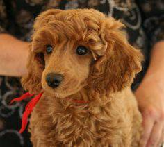
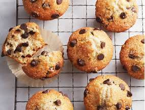

# Project: Dogs, Fried Chicken or Blueberry Muffins?

### [Full Project Description](doc/project3_desc.md)

Term: Fall 2017

+ Team #4
+ Team members
	+ team member 1  Shuyao Hao
	+ team member 2  Fan Gong
	+ team member 3  Hongjie Ren
	+ team member 4  Chenyun Wu
	+ team member 5  Yingbin Jiang

+ Project summary: In this project, we want to identify which category the picture belongs to: Dogs, Fried Chicken or Blueberry Muffins. The process consists of two parts: feature extraction and model training. For the feature extraction part, we adopted SIFT, HOG, LBP totally three methods to extract features from 3000 images. For the model training part, we adopted Logistics, Random Foreest and Support Vector Machine, Gradient Boosting Machine and Neural Network totally five methods to train classification models. 
After several attempts, We found that LBP+Logistic has the highest classification performance and the shortest running time.

Here is the test accuracy of our models:

The comparison of running time:

	

Besides the traditional classification models, we also adopted convolutional neural network, Neural Network requires large amount of data, and we only have 3000 images  in total. Hence we try to duplicate our images by flopping only training images. 

In Neural Network feature extraction step, we first shrink the image to the size of 64*64 and convert colored images to gray images.

The structure of our neural network model includes one convolution layer, one   activation layer, one pooling layer and 1 dropout layer, which forms our first convolution layers and the second convolution layer is the same as the first one. after two convolution layers, we have 2 full connection layers. The structure of each full connection layer is convolution, activation, and dropout layers.

